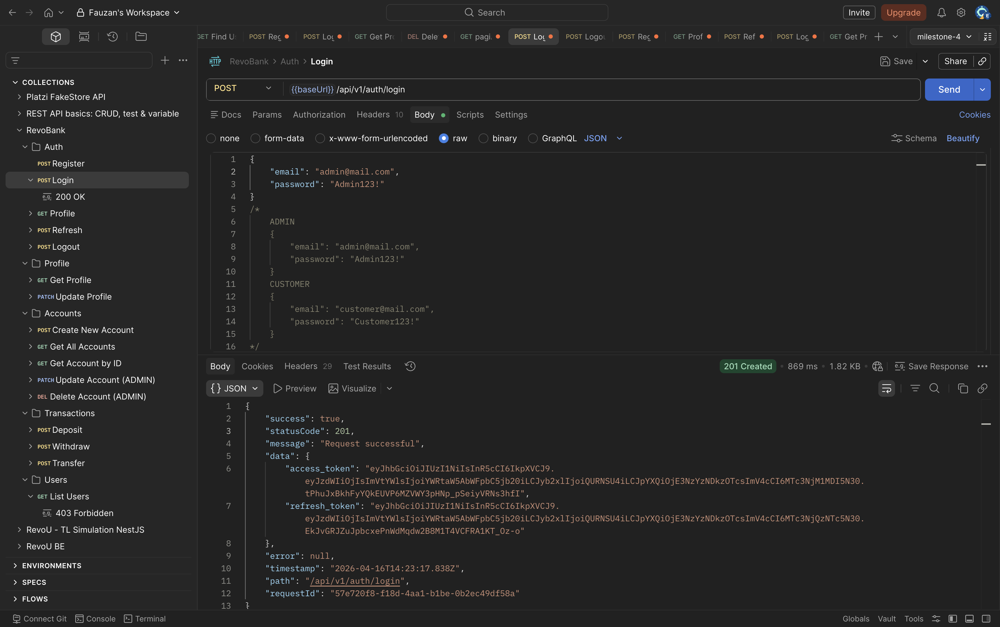
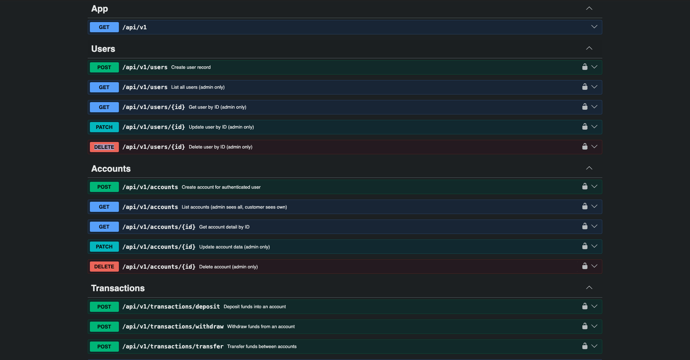
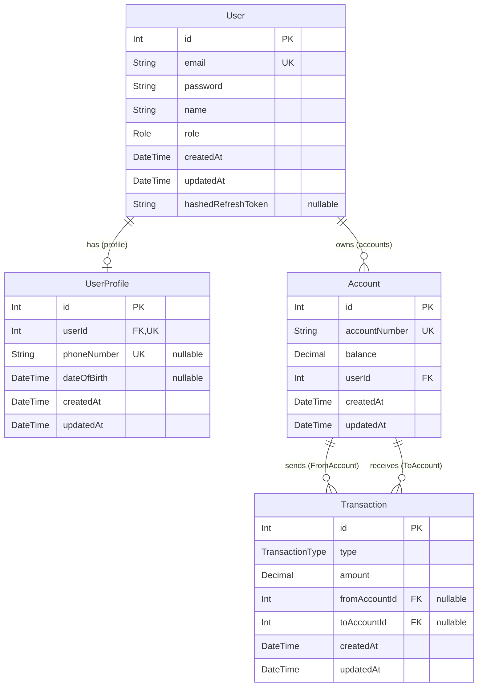

# RevoBank Backend API

Backend API for a banking system simulation built with NestJS, Prisma, and PostgreSQL.

This API serves 2 types of users:

- `CUSTOMER`: manage their own accounts, view profile, deposit, withdraw, and transfer funds.
- `ADMIN`: broader access for monitoring users, accounts, and transactions.

## Tech Stack

- NestJS
- Prisma ORM
- PostgreSQL
- JWT (access token + refresh token)
- Swagger OpenAPI
- Jest (unit/e2e)

## API Base URL & Docs

- Local base URL: `http://localhost:9000/api/v1`
- Swagger UI: `http://localhost:9000/docs`
<!-- - Production base URL (Railway): `https://milestone-4-khankhanfauzan-production.up.railway.app/api/v1` - EXPIRED
- Production Swagger UI (Railway): `https://milestone-4-khankhanfauzan-production.up.railway.app/docs` - EXPIRED-->
- Production base URL (Render): `https://milestone-4-khankhanfauzan.onrender.com/api/v1`
- Production Swagger UI (Render): `https://milestone-4-khankhanfauzan.onrender.com/docs`

## Standard Response Envelope

All responses follow the global envelope format.

```json
{
  "success": true,
  "statusCode": 200,
  "message": "Request successful",
  "data": {},
  "error": null,
  "timestamp": "2026-04-16T10:00:00.000Z",
  "path": "/api/v1/auth/profile",
  "requestId": "uuid"
}
```

## Folder Structure (Important Only)

```text
.
├── prisma
│   ├── migrations
│   ├── schema.prisma
│   └── seed.ts
├── src
│   ├── auth
│   │   ├── decorators
│   │   ├── dto
│   │   ├── guards
│   │   ├── strategies
│   │   ├── auth.controller.ts
│   │   ├── auth.service.ts
│   │   └── auth.repository.ts
│   ├── common
│   │   ├── envelope
│   │   ├── filters
│   │   └── interceptors
│   ├── modules
│   │   ├── users
│   │   │   ├── dto
│   │   │   ├── users.controller.ts
│   │   │   └── users.service.ts
│   │   ├── user-profile
│   │   │   ├── dto
│   │   │   ├── user-profile.controller.ts
│   │   │   ├── user-profile.service.ts
│   │   │   └── user-profile.repository.ts
│   │   ├── accounts
│   │   │   ├── dto
│   │   │   ├── accounts.controller.ts
│   │   │   ├── accounts.service.ts
│   │   │   └── accounts.repository.ts
│   │   └── transactions
│   │       ├── dto
│   │       ├── transactions.controller.ts
│   │       ├── transactions.service.ts
│   │       └── transactions.repository.ts
│   ├── prisma
│   │   ├── prisma.module.ts
│   │   └── prisma.service.ts
│   ├── middleware
│   ├── app.module.ts
│   └── main.ts
├── .env.example
└── package.json
```

## Screenshots (Postman & Swagger)

- Postman: 
- Swagger: 

## Database ER Diagram (Mermaid)


```mermaid
erDiagram
    User {
        Int id PK
        String email UK
        String password
        String name
        Role role
        DateTime createdAt
        DateTime updatedAt
        String hashedRefreshToken "nullable"
    }

    UserProfile {
        Int id PK
        Int userId FK, UK
        String phoneNumber UK "nullable"
        DateTime dateOfBirth "nullable"
        DateTime createdAt
        DateTime updatedAt
    }

    Account {
        Int id PK
        String accountNumber UK
        Decimal balance
        Int userId FK
        DateTime createdAt
        DateTime updatedAt
    }

    Transaction {
        Int id PK
        TransactionType type
        Decimal amount
        Int fromAccountId FK "nullable"
        Int toAccountId FK "nullable"
        DateTime createdAt
        DateTime updatedAt
    }

    %% Relationships
    User ||--o| UserProfile : "has (profile)"
    User ||--o{ Account : "owns (accounts)"
    Account ||--o{ Transaction : "sends (FromAccount)"
    Account ||--o{ Transaction : "receives (ToAccount)"
```

## Module Overview, DTOs, and Flow

### 1. Auth Module

Main files:

- `src/auth/auth.controller.ts`
- `src/auth/auth.service.ts`
- `src/auth/auth.repository.ts`

DTOs:

- `RegisterDto`: registers a new user.
- `LoginDto`: logs in a user.

Flow:

1. Register checks for unique email -> hashes password -> saves user -> generates access and refresh tokens.
2. Login validates email and password -> generates access and refresh tokens.
3. Refresh token uses the `jwt-refresh` guard -> issues a new access token.
4. Logout removes `hashedRefreshToken` so the old refresh token becomes invalid.

### 2. User Profile Module

Main files:

- `src/modules/user-profile/user-profile.controller.ts`
- `src/modules/user-profile/user-profile.service.ts`
- `src/modules/user-profile/user-profile.repository.ts`

DTOs:

- `UpdateUserProfileDto`: updates non-sensitive profile fields (`name`, `phoneNumber`, `dateOfBirth`).

Flow:

1. Get `userId` from JWT.
2. GET profile retrieves data from `users` and `user_profiles`.
3. PATCH profile updates `users.name` and `user_profiles` using upsert.

### 3. Users Module

Main files:

- `src/modules/users/users.controller.ts`
- `src/modules/users/users.service.ts`

DTOs:

- `CreateUserDto`: creates a user by admin.
- `UpdateUserDto`: updates a user partially.

Flow:

1. User management endpoints are restricted to the `ADMIN` role.
2. Available operations: create, list, detail by ID, update, delete.
3. Passwords are always hashed during create and update.
4. User responses do not expose sensitive fields such as `password` and `hashedRefreshToken`.
5. The `/users` endpoint is currently also protected by API key middleware.

### 4. Accounts Module

Main files:

- `src/modules/accounts/accounts.controller.ts`
- `src/modules/accounts/accounts.service.ts`
- `src/modules/accounts/accounts.repository.ts`

DTOs:

- `CreateAccountDto`: creates an account (`accountNumber`, optional `balance`).
- `UpdateAccountDto`: updates an account partially.

Flow:

1. Customer or admin can create an account.
2. Customers can only view their own accounts.
3. Admin can view all accounts.
4. `accountNumber` cannot be changed after the account is created.

### 5. Transactions Module

Main files:

- `src/modules/transactions/transactions.controller.ts`
- `src/modules/transactions/transactions.service.ts`
- `src/modules/transactions/transactions.repository.ts`

DTOs:

- `DepositDto`: `toAccountId` **or** `toAccountNumber`, plus `amount`.
- `WithdrawDto`: `fromAccountId` **or** `fromAccountNumber`, plus `amount`.
- `TransferDto`: `fromAccountId` **or** `fromAccountNumber`, and `toAccountId` **or** `toAccountNumber`, plus `amount`.
- `CreateTransactionDto` and `UpdateTransactionDto`: provided for a generic structure.

Flow:

1. Deposit: validate destination account -> increase balance -> save transaction with type `DEPOSIT`.
2. Withdraw: validate ownership and sufficient balance -> decrease balance -> save transaction with type `WITHDRAW`.
3. Transfer: validate source and destination accounts, ensure they are different, check sufficient balance -> perform atomic debit/credit -> save transaction with type `TRANSFER`.
4. Admin can view all transactions, while customer can only view transactions related to their own accounts.
5. For transaction endpoints, send **exactly one** identifier per account side: `accountId` or `accountNumber`.

## DTO Summary

- `auth/dto/register.dto.ts`
- `auth/dto/login.dto.ts`
- `modules/user-profile/dto/update-user-profile.dto.ts`
- `modules/users/dto/create-user.dto.ts`
- `modules/users/dto/update-user.dto.ts`
- `modules/accounts/dto/create-account.dto.ts`
- `modules/accounts/dto/update-account.dto.ts`
- `modules/transactions/dto/deposit.dto.ts`
- `modules/transactions/dto/withdraw.dto.ts`
- `modules/transactions/dto/transfer.dto.ts`
- `modules/transactions/dto/create-transaction.dto.ts`
- `modules/transactions/dto/update-transaction.dto.ts`

## Postman Request Samples (All Endpoints)

Use:

- Private endpoint header: `Authorization: Bearer <access_token>`
- For `/users*` only: add `x-api-key: <INTERNAL_API_KEY>`

### Auth

#### Register

`POST /api/v1/auth/register`

```json
{
  "email": "customer1@revobank.com",
  "name": "Customer One",
  "password": "StrongPass123!"
}
```

#### Login

`POST /api/v1/auth/login`

```json
{
  "email": "customer1@revobank.com",
  "password": "StrongPass123!"
}
```

#### Get Auth Profile

`GET /api/v1/auth/profile`

#### Refresh Token

`POST /api/v1/auth/refresh`
Header:
`Authorization: Bearer <refresh_token>`

#### Logout

`POST /api/v1/auth/logout`

### User Profile

#### Get Own Profile

`GET /api/v1/user/profile`

#### Update Own Profile

`PATCH /api/v1/user/profile`

```json
{
  "name": "Customer One Updated",
  "phoneNumber": "081234567890",
  "dateOfBirth": "1998-12-30"
}
```

### Users (Admin)

#### Create User

`POST /api/v1/users`
Headers:

- `x-api-key: <INTERNAL_API_KEY>`
- `Authorization: Bearer <access_token_admin>`

```json
{
  "email": "user2@revobank.com",
  "name": "User Two",
  "password": "StrongPass123!",
  "role": "CUSTOMER"
}
```

#### List Users

`GET /api/v1/users`
Headers:

- `x-api-key: <INTERNAL_API_KEY>`
- `Authorization: Bearer <access_token_admin>`

#### Get User By ID

`GET /api/v1/users/1`
Headers:

- `x-api-key: <INTERNAL_API_KEY>`
- `Authorization: Bearer <access_token_admin>`

#### Update User

`PATCH /api/v1/users/1`
Headers:

- `x-api-key: <INTERNAL_API_KEY>`
- `Authorization: Bearer <access_token_admin>`

```json
{
  "name": "Updated User Name"
}
```

#### Delete User

`DELETE /api/v1/users/1`
Headers:

- `x-api-key: <INTERNAL_API_KEY>`
- `Authorization: Bearer <access_token_admin>`

### Accounts

#### Create Account

`POST /api/v1/accounts`

```json
{
  "accountNumber": "123456789012",
  "balance": 500000
}
```

#### List Accounts

`GET /api/v1/accounts`

#### Get Account By ID

`GET /api/v1/accounts/1`

#### Update Account (Admin)

`PATCH /api/v1/accounts/1`

```json
{
  "balance": 750000
}
```

#### Delete Account (Admin)

`DELETE /api/v1/accounts/1`

### Transactions

#### Deposit

`POST /api/v1/transactions/deposit`

```json
{
  "toAccountId": 1,
  "amount": 200000
}
```

Or by account number:

```json
{
  "toAccountNumber": "123456789012",
  "amount": 200000
}
```

#### Withdraw

`POST /api/v1/transactions/withdraw`

```json
{
  "fromAccountId": 1,
  "amount": 50000
}
```

Or by account number:

```json
{
  "fromAccountNumber": "123456789012",
  "amount": 50000
}
```

#### Transfer

`POST /api/v1/transactions/transfer`

```json
{
  "fromAccountId": 1,
  "toAccountId": 2,
  "amount": 100000
}
```

Or by account number:

```json
{
  "fromAccountNumber": "123456789012",
  "toAccountNumber": "987654321098",
  "amount": 100000
}
```

#### List Transactions

`GET /api/v1/transactions`

#### Get Transaction By ID

`GET /api/v1/transactions/1`

## Local Setup & Build Flow

### 1) Install Dependencies

```bash
pnpm install
```

### 2) Set Up Environment

Copy the example file:

```bash
cp .env.example .env
```

Then fill in at least:

- `DATABASE_URL`
- `PORT`
- `JWT_SECRET`
- `JWT_REFRESH_SECRET` (recommended to add)
- `JWT_EXPIRATION`
- `INTERNAL_API_KEY`

### 3) Generate Prisma Client

```bash
pnpm prisma:generate
```

### 4) Run Migration

```bash
pnpm prisma migrate dev
```

### 5) Seed Initial Data (Admin + Customer)

```bash
pnpm prisma:seed
```

### 6) Run App (Development)

```bash
pnpm run start:dev
```

### 7) Build Project

```bash
pnpm run build
```

### 8) Run Production Build

```bash
pnpm run start:prod
```

### 9) Run Tests

```bash
pnpm run test
pnpm run test:e2e
pnpm run test:cov
```

## Deployment Notes (Railway/Render/Fly.io)

- Build command: `pnpm run build`
- Start command: `pnpm run start:prod`
- Make sure all environment variables are fully configured.
- Run migration during release deployment:

```bash
pnpm prisma migrate deploy
```
